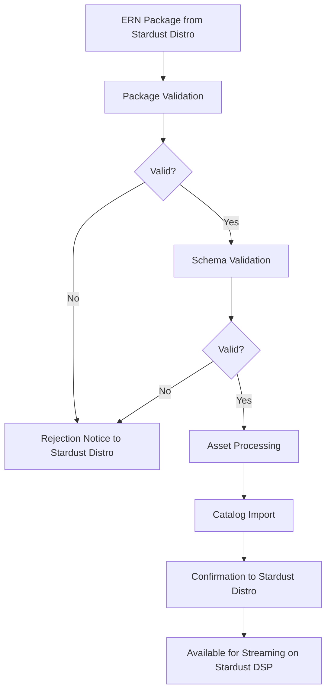

# ERN Ingestion Guide - Stardust DSP

## Overview
Stardust DSP's ingestion system processes Electronic Release Notifications (ERN) messages from distribution platforms like Stardust Distro to automatically catalog music content for streaming.

## Content Sources

### Primary Sources
1. **Stardust Distro**: Our sister distribution platform
2. **Other Distributors**: Third-party distribution services
3. **Direct Labels**: Labels with direct deals

## ERN Message Structure

### Supported ERN Versions
Stardust DSP accepts ERN messages in these versions:
- ERN 4.3 (recommended by Stardust Distro)
- ERN 4.2
- ERN 4.1
- ERN 3.8.2
- ERN 3.8.1

### Required Elements from Stardust Distro
```xml
<NewReleaseMessage>
  <MessageHeader>
    <MessageId>Unique identifier</MessageId>
    <MessageSender>
      <PartyName>Stardust Distro</PartyName>
      <PartyId>PADPIDA2025STARDUSTDISTRO</PartyId>
    </MessageSender>
    <MessageRecipient>
      <PartyName>Stardust DSP</PartyName>
      <PartyId>PADPIDA2025STARDUSTDSP</PartyId>
    </MessageRecipient>
    <MessageCreatedDateTime>ISO 8601 timestamp</MessageCreatedDateTime>
  </MessageHeader>
  
  <ReleaseList>
    <Release>
      <ReleaseId>Primary release identifier</ReleaseId>
      <ReleaseReference>Internal reference</ReleaseReference>
      <ReleaseDetailsByTerritory>
        <TerritoryCode>ISO country code</TerritoryCode>
        <Title>Release title</Title>
        <Artist>Display artist</Artist>
      </ReleaseDetailsByTerritory>
    </Release>
  </ReleaseList>
  
  <ResourceList>
    <SoundRecording>
      <ResourceReference>Internal reference</ResourceReference>
      <ISRC>International Standard Recording Code</ISRC>
      <Title>Track title</Title>
      <Duration>ISO 8601 duration</Duration>
    </SoundRecording>
  </ResourceList>
</NewReleaseMessage>
```

## Ingestion Process for Stardust DSP

### 1. Delivery Methods from Stardust Distro

#### FTP/SFTP Upload
```bash
# Stardust Distro connects to Stardust DSP ingestion server
sftp stardust_distro@ingestion.stardust-dsp.com

# Navigate to Stardust Distro inbox
cd /inbox/stardust-distro/

# Upload ERN package
put release-package.tar.gz

# Trigger processing
touch release-package.ready
```

#### API Submission from Stardust Distro
```javascript
// Stardust Distro submits to Stardust DSP
const submitToStardustDSP = async (ernXml, assets) => {
  const formData = new FormData();
  formData.append('ern', new Blob([ernXml], { type: 'text/xml' }));
  formData.append('source', 'stardust_distro');
  
  assets.forEach(asset => {
    formData.append('assets', asset.file, asset.filename);
  });
  
  const response = await fetch('https://api.stardust-dsp.com/ingestion/submit', {
    method: 'POST',
    headers: {
      'Authorization': `Bearer ${STARDUST_DSP_TOKEN}`
    },
    body: formData
  });
  
  return response.json();
};
```

#### Cloud Storage Sync
Automated ingestion from Stardust Distro's cloud storage:
- Amazon S3 buckets
- Google Cloud Storage
- Azure Blob Storage

### 2. Package Structure from Stardust Distro
```
stardust-distro-package/
├── manifest.xml              # Package manifest
├── ERN/
│   └── release.xml          # ERN message
├── resources/
│   ├── audio/
│   │   ├── track01.flac    # High-quality audio
│   │   └── track02.flac
│   └── images/
│       ├── cover.jpg        # Cover art
│       └── booklet.pdf      # Digital booklet
└── checksums.md5            # File checksums
```

## Validation Pipeline in Stardust DSP

### Step 1: Package Validation
- Verify package from Stardust Distro
- Check manifest completeness
- Validate checksums (MD5/SHA256)
- Confirm file presence

### Step 2: Schema Validation
- Validate against DDEX XSD schema
- Check ERN version compatibility
- Verify required elements
- Validate data types

### Step 3: Business Rules
- Verify ISRC format
- Validate UPC/EAN codes
- Check release dates
- Confirm territory codes
- Validate duration formats

### Step 4: Asset Validation
- Audio file integrity
- Supported formats (FLAC, WAV, MP3)
- Image requirements (resolution, format)
- Metadata extraction

## Processing Workflow in Stardust DSP



## Asset Requirements for Stardust DSP

### Audio Files from Stardust Distro
- **Formats**: FLAC (preferred), WAV, MP3 (320kbps minimum)
- **Sample Rate**: 44.1kHz or higher
- **Bit Depth**: 16-bit or 24-bit
- **Channels**: Stereo or Mono
- **Naming**: `[ISRC]_[TrackNumber].[extension]`

### Image Files
- **Cover Art**: 
  - Minimum: 1500x1500 pixels
  - Recommended: 3000x3000 pixels
  - Format: JPEG or PNG
  - Color: RGB
- **Additional Images**:
  - Artist photos
  - Booklet pages
  - Promotional materials

### Metadata Files
- **Lyrics**: Plain text or LRC format
- **Credits**: XML or JSON format
- **Liner Notes**: PDF or text

## Error Handling for Stardust Distro Deliveries

### Common Errors

#### Schema Errors
```xml
<Error>
  <ErrorCode>ERN_001</ErrorCode>
  <ErrorMessage>Invalid ERN structure from Stardust Distro</ErrorMessage>
  <Details>Missing required element: ReleaseId</Details>
  <Line>45</Line>
  <Source>stardust_distro</Source>
</Error>
```

#### Asset Errors
```json
{
  "error": "ASSET_002",
  "message": "Audio file corrupted",
  "file": "track01.flac",
  "details": "Invalid FLAC header",
  "source": "stardust_distro"
}
```

#### Business Rule Errors
```json
{
  "error": "BIZ_003",
  "message": "Invalid ISRC",
  "value": "USRC1234",
  "expected": "12 characters (e.g., USRC12345678)",
  "source": "stardust_distro"
}
```

### Error Recovery
1. **Automatic Retry**: System retries transient failures
2. **Partial Success**: Process valid assets, report errors to Stardust Distro
3. **Manual Intervention**: Flag for manual review
4. **Resubmission**: Allow Stardust Distro to resubmit corrected packages

## Monitoring & Status

### Real-time Status for Stardust Distro
```javascript
// Check ingestion status from Stardust Distro
const checkStardustDistroDelivery = async (ingestionId) => {
  const response = await fetch(`/api/ingestion/status/${ingestionId}`);
  return response.json();
};

// Response
{
  "ingestionId": "ING_123456",
  "source": "stardust_distro",
  "status": "processing",
  "progress": 75,
  "steps": {
    "validation": "completed",
    "assetProcessing": "in_progress",
    "catalogImport": "pending"
  },
  "logs": [...]
}
```

### Webhook Notifications to Stardust Distro
```json
{
  "event": "ingestion.completed",
  "ingestionId": "ING_123456",
  "source": "stardust_distro",
  "releases": ["REL_789"],
  "tracks": ["TRK_001", "TRK_002"],
  "timestamp": "2025-01-31T12:00:00Z",
  "dsp": "stardust_dsp"
}
```

## Best Practices for Distributors

### File Organization
- Use consistent naming conventions
- Include checksums for all files
- Compress large packages
- Separate releases logically

### Metadata Quality
- Provide complete metadata
- Use standard identifiers (ISRC, UPC)
- Include high-resolution artwork
- Specify all territories

### Performance Optimization
- Batch multiple releases
- Upload during off-peak hours
- Use parallel uploads for assets
- Compress audio losslessly

## Testing with Stardust Distro

### Test Environment
Test deliveries from Stardust Distro:
```
Stardust DSP Test Endpoint: test-ingestion.stardust-dsp.com
Stardust Distro Test: test.stardust-distro.com
Credentials: Provided separately
```

### Sample ERN Messages
Download sample messages accepted by Stardust DSP:
- [Basic Audio Album](https://samples.stardust-dsp.com/ern/album.xml)
- [Single with Video](https://samples.stardust-dsp.com/ern/single-video.xml)
- [Compilation Release](https://samples.stardust-dsp.com/ern/compilation.xml)

### Validation Tools
```bash
# Validate ERN for Stardust DSP
stardust-dsp-cli validate ern release.xml

# Test package structure
stardust-dsp-cli validate package release-package/

# Check asset compliance
stardust-dsp-cli validate assets resources/
```

## Automation for Stardust Distro Integration

### CI/CD Integration
```yaml
# GitHub Actions for Stardust Distro to Stardust DSP
name: Release to Stardust DSP
on:
  push:
    branches: [main]
    
jobs:
  deliver:
    runs-on: ubuntu-latest
    steps:
      - uses: actions/checkout@v2
      - name: Prepare ERN Package
        run: |
          ./scripts/prepare-ern.sh
      - name: Submit to Stardust DSP
        run: |
          stardust-distro-cli deliver \
            --target stardust_dsp \
            --package ./release-package \
            --api-key ${{ secrets.STARDUST_DSP_API_KEY }}
```

### Scheduled Ingestion from Stardust Distro
```javascript
// Schedule regular catalog updates from Stardust Distro
const scheduleStardustDistroIngestion = {
  source: 'stardust_distro',
  frequency: 'hourly',
  endpoint: 's3://stardust-distro-deliveries/',
  notification: 'ingestion@stardust-dsp.com'
};
```

## Support & Resources

### Documentation
- [DDEX ERN Standards](https://ddex.net/standards/ern)
- [Stardust DSP Ingestion API](https://docs.stardust-dsp.com/ingestion)
- [Stardust Distro Integration Guide](https://docs.stardust-distro.com/dsp-integration)

### Tools
- ERN Validator: https://validator.stardust-dsp.com
- Package Builder: https://builder.stardust-dsp.com
- Status Dashboard: https://status.stardust-dsp.com

### Support Contacts
- Stardust DSP Ingestion: ingestion@stardust-dsp.com
- Stardust Distro Support: support@stardust-distro.com
- Integration Slack: #stardust-integration
- Priority Support: priority@stardust-dsp.com